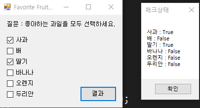

# StudyDesktopApp
C# 데스크톱 앱 개발 학습 리포지토리   

---

# 2021.03.09 Day1   
#### 폼 생선 전 기본 형태   
```
form1.cs -> frmMain.cs   
startposition 잡아주기   
icon 생성 
전체 폼 틀을 잡아주기   
```

### Practice App Template
   

### Label Test App   
   

### CheckBox Test App   
   

### Masked Test App


### Radio Test App
   

### Flag Test App
  

### Login Test App
  

### ColorChange Test App
   

---   

# 2021.03.10 Day2   

### ListBox Test App   
```
** listbox 넣는 방법 **   
1. 디자인 타입 : 폼에서 바로 디자인   
2. 런 타입 : 코딩 후 실행했을 때 동작하는 방식   

* 리스트 박스 넣는 방법 
  : 가장 기본적인 코딩
private void FrmMain_Load(object sender, EventArgs e)
        {
            //살기 좋은 도시 초기화 , 가장 기본적인 리스트박스 추가
            LsbGoodCity.Items.Add("오스트리아,빈");
            LsbGoodCity.Items.Add("호주, 맬버른");
            LsbGoodCity.Items.Add("일본,오사카");
            LsbGoodCity.Items.Add("캐나다,캘거리");
            LsbGoodCity.Items.Add("호주, 시드니");
            LsbGoodCity.Items.Add("캐나다, 밴쿠버");
            LsbGoodCity.Items.Add("일본, 도쿄");
            LsbGoodCity.Items.Add("캐나다, 토론토");
            LsbGoodCity.Items.Add("덴마크, 코펜하겐");
            LsbGoodCity.Items.Add("호주, 애들레이드");

            List<string> lstCountry = new List<string>() { 
                "미국","러시아","중국","독일","프랑스","일본","이스라엘",
                "사우디아라비아","UAE","한국","영국","스웨덴"
            };
            LsbHappyCountry.DataSource = lstCountry;   
            
 ```
      
   

### 잠깐의 이론! 
```
**Tostring : Object값이다
**Sender : Object값이다
			이벤트는,
			Object의 Class 로 박싱해준다 즉, 초기화 원래상태로 돌려준다. 
			모든 컨트롤이 이벤트에 있다.
			하나로 통일해서 델리게이트 (대리자) 해야한다.
			Ex) private void LsbHappyCountry_SelectedIndexChanged(object sender, EventArgs e)
			이벤트에 대한 이름을 쓰고, 
			앞에는 이벤트보내준 객체를 설명, 뒤에는 이벤트 속성을 설명(아규먼트)
			델리게이트를 선언 후에 객체가 다양하기 때문에 합친 값이 Object값이다.
			그 다음 object로 박싱한 다음 사용하기 위해서 unboxing을 해야한다. 
			∴ 값을 돌려주는 초기화를 시켜준다 
			1. 형변환 
			- 값 타입 : ()
			- 참조 타입 : as     
```  

### Rastaurent Test App   

   

### Travel Test App   
   

### ListView Test App
   

### StudyHistory Test App
   

### Clock Test App   
   

### DateCalc Test App
    

---   
# 2021.03.11 Day3   
#### 오늘의 핵심 Point! WPF!   
### 잠깐의 이론!   
```
WDF(Windows Presentation Foundation) : 윈도우 애플리케이션을 만드는 또 다른 방법!   
가장 큰 장점은,   
디자인과 프로그램 로직이 분리되어 있다는 점!   
편리한 동적 레이아웃을 제공!   
창의 크기 변화에 따라 컨트롤들의 크기 및 위치를 바꿀 수 있음!   
강력한 데이터바인딩을 제공한다는 점!   
새로운 버튼 컨트롤을 만들어서 사용할 수 있음!   

개인적으로 윈폼 보다 코딩차이는 없었으나 타입작업이 훨씬 수월했다는 점이 좋았다.   
```

### AlarmClock Test App   
  

### MediaPlayer Test App   
   

### OpenfileDialog Test App   
    

### GraphicEditor Test App   
   

### WPF_BMICalc Test App
   

### WPF_Blinker Test App   
   

# 2021.03.12 Day3   
## C# 응용 프로그램 작성   

### WDF VS WinForm Calculator Test App   

#### WDF      
    
#### WinForm   
    

### WPF_AnalogClock Test App   
    

### WPF_몬테카를로 시물레이션 원주율 찾기   
   

### WPF_MYNOTEPAD Test App   
   

```
노트패드 기능   
1. 파일   
2. 편집 
3. 도움말   
 * 새로만들기 / 열기 / 저장 / 종료 
 * 복사하기 / 붙여넣기
 * 프로그램 정보  
전부 실행할 수 있도록 코딩   
```


